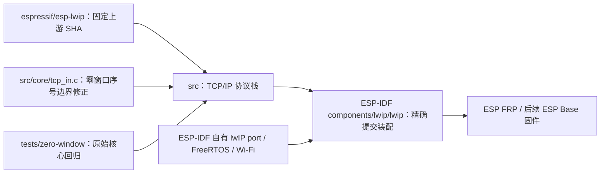

# ESP lwIP

ESP-IDF 的 lwIP 源依赖，基于 [espressif/esp-lwip](https://github.com/espressif/esp-lwip) 的 `c6f2f878e7b0f86033214b85547d579be43351e3`（ESP-IDF v6.1 所选版本）。仅维护已在 ESP32-C3 复现的零窗口纯 ACK 根因修正及其回归，保留完整上游历史、源文件版权和 [BSD 许可证](COPYING)。本仓不替代 ESP-IDF 的 FreeRTOS、网络适配或产品 FRP/MQTT 实现。

新增的 `tests/zero-window` 回归代码使用 Apache-2.0，全文见 [测试许可证](tests/zero-window/LICENSE)。lwIP 原始源码与 `tcp_in.c` 根因修正继续遵循原 BSD-3-Clause 条款。

## 架构拓扑



消费方必须同时锁定 ESP-IDF 与本仓完整提交，使用独立 SDK checkout；不得直接修改机器已有 SDK、在构建时临时替换函数或按浮动分支获取修正。当前真实消费者为 ESP FRP，ESP Base 组合接入仍待后续阶段。

## 根因与范围

两端接收窗口都为零时，原逻辑把 `SEG.SEQ == RCV.NXT` 的空 ACK 误判为窗外报文，并回复另一个空 ACK。板内回环持续处理这些报文，使 TCP/IP 任务无法返回应用层。修正直接落实 [RFC 9293 表 6](https://www.rfc-editor.org/rfc/rfc9293.html#table-6)：零长度、零窗口时精确接受 `RCV.NXT`；非零窗口维持既有半开区间判断。

不丢弃报文，不改变窗口或缓冲容量，不关闭看门狗、证书或认证校验。C3 对照实验与 FRP 资源边界见 [ESP FRP 问题记录](https://github.com/esp-space/esp-frp/blob/master/docs/issues/c3-loopback-memory-pressure.md)。通过本仓回归不代表产品内存预算、全部协议场景或长稳已经通过。

## 验证

```bash
cmake -S tests/zero-window -B /tmp/esp-lwip-check \
  -DCMAKE_C_FLAGS="-fsanitize=address,undefined -fno-omit-frame-pointer -g"
cmake --build /tmp/esp-lwip-check
ctest --test-dir /tmp/esp-lwip-check --output-on-failure
```

不依赖 ESP 设备、私有配置或相邻仓。普通序号与 32 位回绕各执行 100 次双向窗口填满/恢复、精确字节验证，并检查零窗口错误序号及非零窗口边界。可显式传 `LWIP_SOURCE_DIR` 验证其他实际 SDK 源码；原始固定上游应暴露失败，不将失败标为通过。具体范围见 [回归入口](tests/zero-window/README.md)。上游其他说明保存在原样的 [README](README) 与 `doc/`。

工作区工程合同见 [嵌入式标准](https://github.com/darren-you/darren-space/blob/master/harness/docs/workspace/standards/embedded_firmware/embedded_firmware_golden_path.md)。本仓交付协议栈源码，不创建固件、分区、部署 Job 或新的运行服务。
