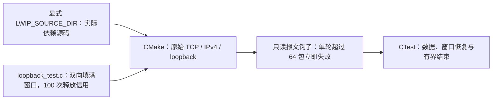

# lwIP 零窗口回环回归

独立编译调用方显式提供的真实 lwIP 核心，验证两个 TCP 接收窗口同时归零后能返回应用层、恢复窗口并继续逐字节传输。两个用例分别从普通初始序号及接近 32 位回绕的位置开始，各执行 100 轮，另验证零窗口的相等/错误序号和非零窗口的左右边界。此测试用于已经在 C3 双流 FRP 样例观察到的 SDK 缺陷，不链接 FRP、TLS 或工作区其他仓，不修改 SDK。

## 架构拓扑



```bash
cmake -S tests/zero-window -B /tmp/esp-lwip-check \
  -DLWIP_SOURCE_DIR=/absolute/path/to/esp-idf/components/lwip/lwip \
  -DCMAKE_C_FLAGS="-fsanitize=address,undefined -fno-omit-frame-pointer -g"
cmake --build /tmp/esp-lwip-check
ctest --test-dir /tmp/esp-lwip-check --output-on-failure
```

当前 ESP-IDF v6.1 的 `esp-lwip@c6f2f878e7b0f86033214b85547d579be43351e3` **预期会暴露真实失败**，不将它设置为 `WILL_FAIL` 或计作通过。失败钩子只输出长度、flags、窗口及序号相等判断；不吞包、改窗口或修改 TCP 状态。ASan/UBSan 的宿主对齐使用 8 字节；此 raw API 最小复现不代表 FreeRTOS、Wi-Fi 或 MCU 资源验收。

问题和实验边界见 [C3 回环问题](https://github.com/darren-you/esp-frp/blob/master/docs/issues/c3-loopback-memory-pressure.md)。序号接受语义依据 [RFC 9293 表 6](https://www.rfc-editor.org/rfc/rfc9293.html#table-6)。本回归单独通过不能替代真实板、资源预算和完整 FRP 矩阵。
